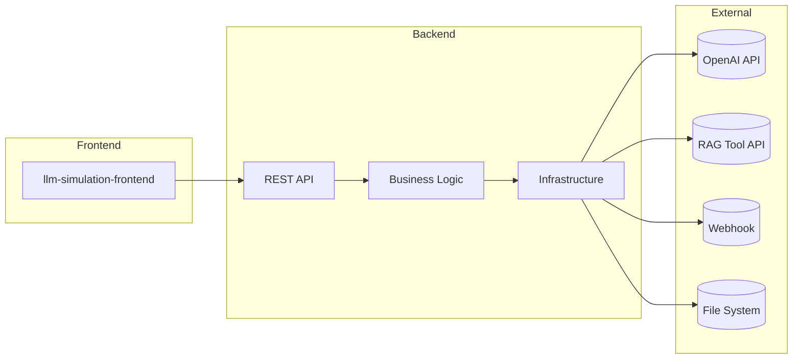

# LLM Agents Simulation & Evaluation Service

## Overview
This repository provides a backend and frontend for simulating multi‑agent conversations and evaluating the results. It is intended for testing prompt workflows, agent hand‑offs and automated scoring.

## Purpose
The project solves the need for repeatable conversation simulations without relying on third‑party tools. It helps prompt engineers and QA teams validate complex multi‑agent flows before deploying them to production.

## Dependencies
### External
- **OpenAI API** – LLM interaction
- **RAG Tool API** – business tool emulation at `aiwingg.com/rag`
- **Webhook Endpoint** – optional session initialization and client data
- **File System** – local storage for results and logs

### Internal
- **llm-simulation-service** – Flask based backend API
- **llm-simulation-frontend** – React web client

## Architecture


## Core Modules
- **llm-simulation-service** – backend Flask application with business logic and integrations
- **llm-simulation-frontend** – React interface for launching and monitoring simulations
- **server.py** – experimental FastAPI server used for research

## Configuration System
Environment variables are documented in [config_system.md](llm-simulation-service/docs/configuration/config_system.md). Startup creates the necessary result and log directories automatically.

## Setup and Deployment
1. Clone the repository and install backend dependencies:
   ```bash
   git clone https://github.com/aiwingg/agents_simulations.git
   cd agents_simulations/llm-simulation-service
   python -m venv venv
   source venv/bin/activate
   pip install -r requirements.txt
   cp .env.example .env  # add your OPENAI_API_KEY
   ```
2. Install frontend dependencies:
   ```bash
   cd ../llm-simulation-frontend
   pnpm install
   cp .env.local.example .env.local
   ```
3. Launch services:
   ```bash
   # Backend
   cd ../llm-simulation-service && python src/main.py

   # Frontend (new terminal)
   cd ../llm-simulation-frontend && pnpm dev
   ```
Docker images and compose file are also provided, see [deployment guide](llm-simulation-service/docs/deployment/deployment_guide.md).
