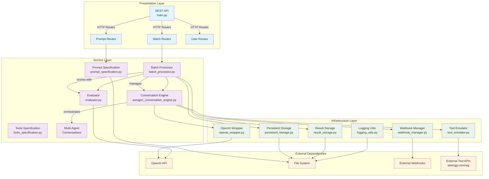

# LLM Simulation Service

A specialized service for testing and optimizing multi-agent conversational AI systems through scalable simulation and automated evaluation.

## Overview

This service enables systematic testing of multi-agent systems (MAS) by simulating conversations between multiple specialized agents (sales, support, etc.) and scripted clients, followed by automated quality evaluation. Built specifically to solve the lack of ready-to-use solutions for testing multi-agent conversational AI infrastructure.

### Key Features

- **Multi-Agent Conversations**: Support for dynamic agent handoffs during conversations
- **Scalable Batch Processing**: Parallel execution of thousands of test scenarios  
- **Deterministic Testing**: Reproducible results using consistent seeds and prompts
- **Prompt Engineering Support**: File-based prompt management with validation
- **Comprehensive Evaluation**: Automated scoring with detailed feedback
- **Multiple Interfaces**: REST API and CLI for different workflows

## Purpose of this Codebase

This service was created to address the specific need for testing multi-agent systems where:

- **No existing solutions** fit our infrastructure requirements
- **Prompt optimization** requires systematic testing across many scenarios
- **Multi-agent coordination** needs evaluation (handoffs, context preservation)
- **Scale testing** demands parallel execution capabilities
- **Quality assurance** requires automated, consistent evaluation

The service enables QA teams and prompt engineers to validate conversational AI systems before deployment, ensuring agent coordination works correctly and prompts perform as expected across diverse scenarios.

## Architecture

**Architecture Principles:**
- **Presentation Layer**: Handles user interfaces and API endpoints
- **Service Layer**: Contains business logic for simulation orchestration
- **Infrastructure Layer**: Manages external dependencies and data persistence

## Documentation

### Setup & Usage
- [Configuration System](docs/configuration/config_system.md) - Environment variables, settings, validation
- [Deployment Guide](docs/deployment/deployment_guide.md) - Docker setup, environment configuration
- [Scripts Overview](docs/scripts_overview.md) - CLI tools and their interfaces

### Architecture Deep Dive
- [Presentation Layer](docs/layers/presentation_layer.md) - API routes, request handling, validation
- [Service Layer](docs/layers/service_layer.md) - Business logic, workflow orchestration
- [Infrastructure Layer](docs/layers/infrastructure_layer.md) - External integrations, storage adapters
- [Modules Overview](docs/modules_overview.md) - Complete file-to-layer mapping

### API & Contracts
- [HTTP API Reference](docs/contracts/http_api_openapi.yaml) - Complete OpenAPI specification
- [Service Contracts](docs/contracts/service_layer_contracts/) - Internal service interfaces
- [Storage Contracts](docs/contracts/storage_contracts/) - Data persistence interfaces
- [Infrastructure Contracts](docs/contracts/infra_util_contracts/) - External adapter contracts
